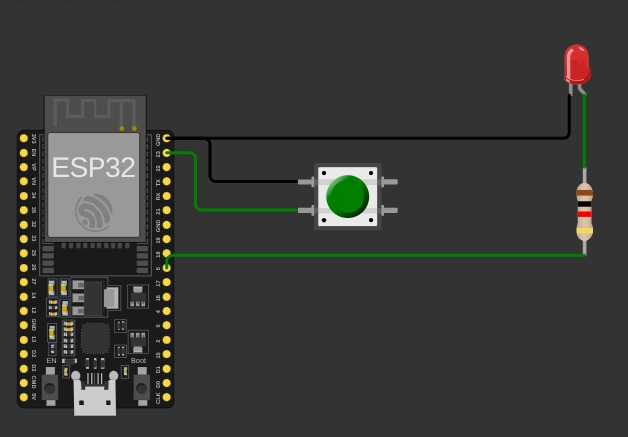
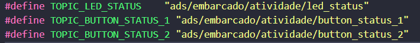

# Discentes: Daniel Ferreira, Jalmir Silva de Siqueira & Joelmir Silva de Siqueira.

## 1 - Configuração do circuito
Perna positiva do LED está conectada ao resistor, o resistor está conectado na porta 5 e a outra perna do LED está conectada ao GND. Já o botão está com uma perna conectada a porta 23 e a outra ao GND.

## 2 - Conexão do ESP32 com Wifi
Adaptamos a conexão a partir do template ESP-IDF "Wifi getting started", removendo as partes que não foram necessárias para o nosso projeto. Fizemos o include do módulo apartir do arquivo modificado disponível em [wifi.c](main/includes/wifi.c) e a função a ser importada pelo app_main.c está disponível em [wifi.h](main/includes/wifi.h). Utilizamos uma wifi privada, criada a partir de um Hotspot móvel (credenciais alteradas a partir do sdkconfig).

## 3 - Broker MQTT
Utilizamos o HiveMQ como Broker, no cluster público mqtt://broker.hivemq.com. Usamos conexão não criptografada pela porta 1883, portanto, não foi necessário baixar certificado TLS. Também não utilizamos autenticação.
Utilizamos os tópicos: 

## 4 - Funcionamento do código
### Funções
* **led_set_state:** seta o estado do led conforme o argumento recebido e publica o novo estado do led no tópico correspondente;

* **mqtt5_event_handler:** trata todos os eventos recebidos pelo mqtt gerando um log do ocorrido e em casos específicos publicando em tópicos específicos, de acordo com o evento recebido; Eventos que publicam em tópicos:
    * MQTT_EVENT_CONNECTED: ao estabelecer a conexão publica _"ONLINE"_ no tópico referente ao status do sistema e inscreve-se para receber as publicações do botão;
    * MQTT_EVENT_DISCONNECTED: ao desconectar publica _"OFFLINE"_ no tópico referente ao status do sistema;
    * MQTT_EVENT_DATA: ao receber dados de publicação do botão verifica o nos dados o estado atual do boão e aciona a função led_set_state para alterar o estado do led, conforme os dados recebidos;
* **mqtt_app_start:** carrega as configurações da conexão com o broker, registra a função mqtt5_event_handler para tratar os eventos do cliente mqtt e inicia a conexão.
* **button_task:** verifica se houve alteração no estado do botão e quando houver publica no respectivo tópico;
* **app_main:** inicia a conexão wifi, configura o pino de led como saída e o do botão como entrada (com _pullup_), inicia a conexão com o broker mqtt e inicia a função button_task como uma tarefa.

**Obs:** a função responsável pela conexão com wifi está em outro arquivo ([wifi.c](main/includes/wifi.c)) como mencionado no item 2.

### Execução do código
Permite que ao manter pressionado o botão conectado a uma placa esp32 o led conectado a outra placa permaneça aceso até que o botão seja solto. E o mesmo se aplica a segunda placa esp32.